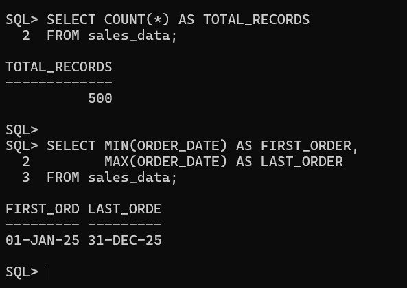
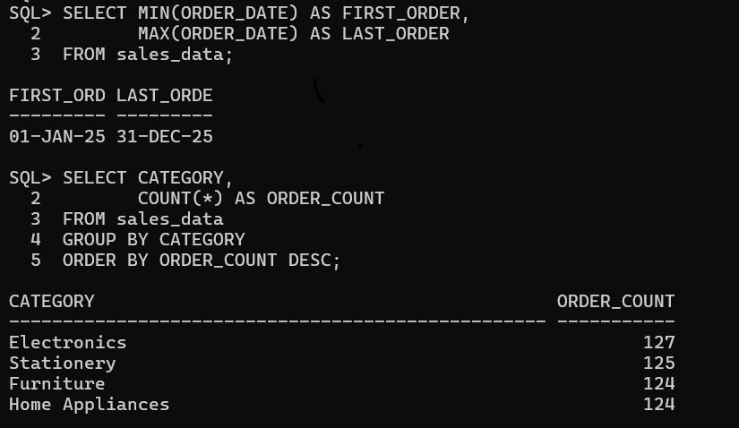
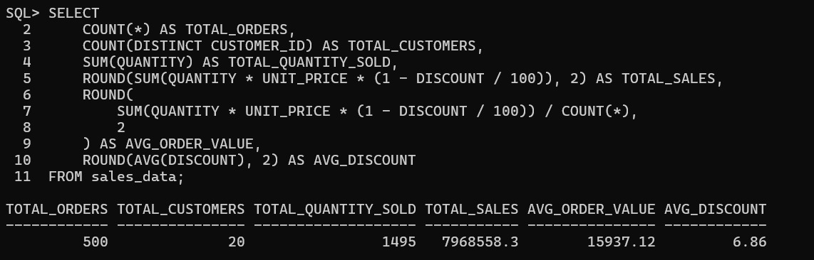

# 📊 SQL Sales Analysis

## 📌 Project Overview

This project analyzes sales transaction data using SQL to identify sales trends, top-performing products, customer behavior, and overall business performance.

The goal is to answer practical business questions using SQL and generate actionable insights from sales data.

## 🛠️ Tools & Technologies

- SQL
- Relational Database
- Data Analysis

## 📚 SQL Concepts Used

- SELECT
- WHERE
- GROUP BY
- ORDER BY
- HAVING
- Aggregate Functions
- CASE Statements
- JOINs
- Subqueries
- Common Table Expressions (CTEs)
- Window Functions
- Date Functions

## 🎯 Business Questions

1. What is the total sales revenue?
2. Which products generate the highest revenue?
3. Which customers have the highest purchase value?
4. What are the monthly sales trends?
5. Which category performs best?
6. What is the average order value?
7. Which products have the highest sales quantity?
8. Who are the top customers?
9. How does sales performance vary by month?
10. What business insights can be identified from the data?

## 📁 Project Files

- `sales_analysis.sql` – SQL queries used for the analysis
- `sales_data.csv` – Dataset used for the project

## 💡 Key Insights

Insights will be added after completing the SQL analysis.

## 👨‍💻 Author

**Guggilapu Venkata Ramana**

Aspiring Data Analyst | SQL | Power BI | Python | Excel

📧 vguggilapu105@gmail.com
🔗 **LinkedIn:** [Venkata Ramana](https://www.linkedin.com/in/venkata-ramana-guggilapu-179008382/)
## Key Results

The analysis of 500 sales transactions produced the following results:

| Metric | Result |
|---|---:|
| Total Orders | 500 |
| Total Customers | 20 |
| Total Quantity Sold | 1,495 |
| Total Sales | 7,968,558.30 |
| Average Order Value | 15,937.12 |
| Average Discount | 6.86% |

### Category Performance

| Category | Orders |
|---|---:|
| Electronics | 127 |
| Stationery | 125 |
| Furniture | 124 |
| Home Appliances | 124 |

## Analysis Screenshots

### Dataset Verification

### Category Analysis

### Sales KPIs

